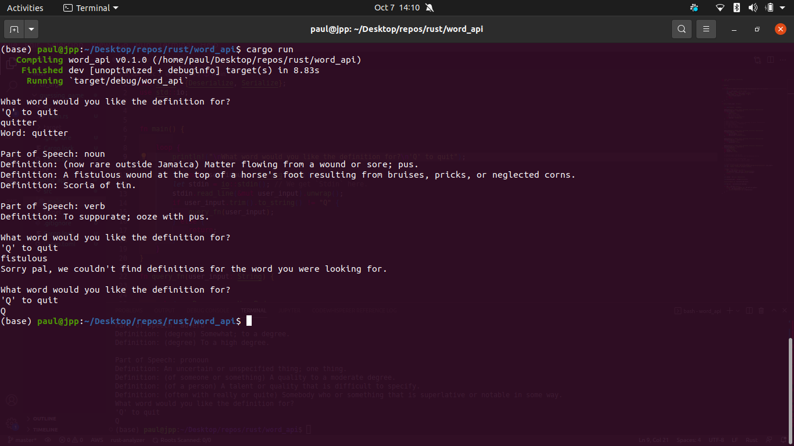

# Dictionary API Terminal App

## Allow a user to query a dictionary API using Rust, Serde and Reqwests


### An example of running the program:



API link --- https://dictionaryapi.dev/ ---

### To run the project, clone the repository and run
```
cargo run
```
**note: Rust and cargo must be installed**

### Terminal command to install Rust on Mac or Linux below
```
curl --proto '=https' --tlsv1.2 -sSf https://sh.rustup.rs | sh
```
  
